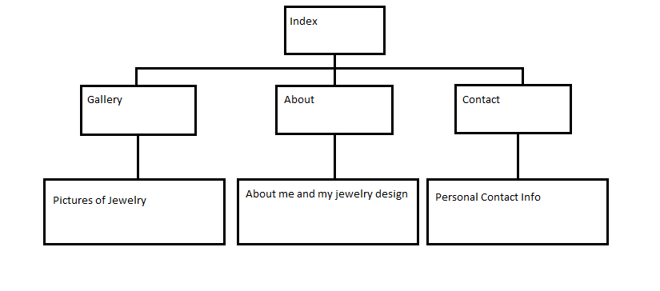
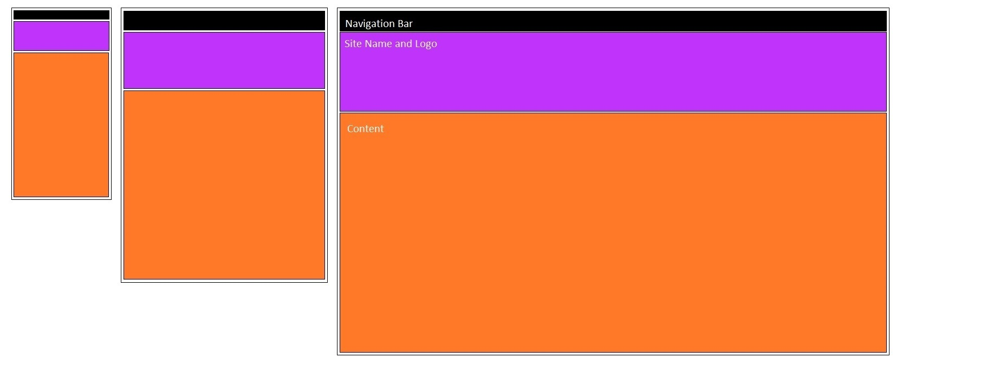

Olivia Coleman 51

# `Final`

## 1. Beginning
My final website is going to have an index page which will link to a gallery of some jewelry I have made, a contact page, and a page about me and my jewelry design. This is a basic idea, and it may change as I create the site. I may add more pages, but I am not sure yet. I may also add links with my previous web pages I created for this class. I would like to have my gallery page incorporate parallax scrolling, so it will be a little different than the other pages. I am using my own pictures for my jewelry and logo. I don't have a great camera, so hopefully it turns out OK.

Color Scheme: Purple, Orange, Black

Rough Sketch:

Wire Frame for Home Page:

## 2. Summary
* I created the files and folders.
* I took pictures of all my jewelry for the site and logo and edited it.
* I created my navigation bar and header for the site first.
* Then I worked on my contact page and gallery.
* I ended up using the parallax scrolling technique on my `about` page instead of the `gallery`.

## 3. Resources
* [Beads](https://beadmuseum.wordpress.com/)
* [Beads2](http://www.powwowsupply.com/100-Seed-Beads-Opaque-Navy-Blue_p_3192.html)
* [Beads3](http://www.powwowsupply.com/100-Seed-Beads-Silver-Lined-Dark-Red_p_3249.html)
